# gerenciador-bancario
Bem vindo ao meu projeto que simula um registro de contas bancarias com função de deposito e transferência básica
## Habilidades
Neste projeto usei de API's REST com um modelo MSC.
usei o node.JS  que é a ferramenta do Google Chrome responsável por ler e executar as instruções que escrevo em JavaScript,ele é um runteme  do JavaScript
usei o express que  é um framework Node.js criado para facilitar a criação de APIs HTTP com Node.
usei um banco não relacional MongoDB para armazenar os dados.
## clone
faça o clone do projeto com o seguinte comando em seu terminal 
`git clone git@github.com:aythan-azevedo/gerenciador-bancario.git`
e entrar
`cd gerenciador-bancario`
## Necessário
-para conseguir execultar o projeto você vai precisar de um simulador de cliente como o insominia 
==> https://www.bitbaru.com/site/como-instalar-o-insomnia-no-linux-crie-solicitaes-http-e-obtenha-informaes-detalhadas/

- é necessário instalar as dependências do node.js com o comando: `npm install node`
- inicie o projeto com o comando `npm start`
## criando um usuário 
insira esse endereço no cliente que você está usando com a modalidade post.
`http://localhost:3000/register`
e coloque o comando nele assim como no exemplo
``` 
{
  "nome": "ricardo",
  "cpf": 78945612305
}
```
==> crie 2 usuários para testar a transferência depois
``` 
{
  "nome": "aylana",
  "cpf": 78945612306
}
```
exemplo: 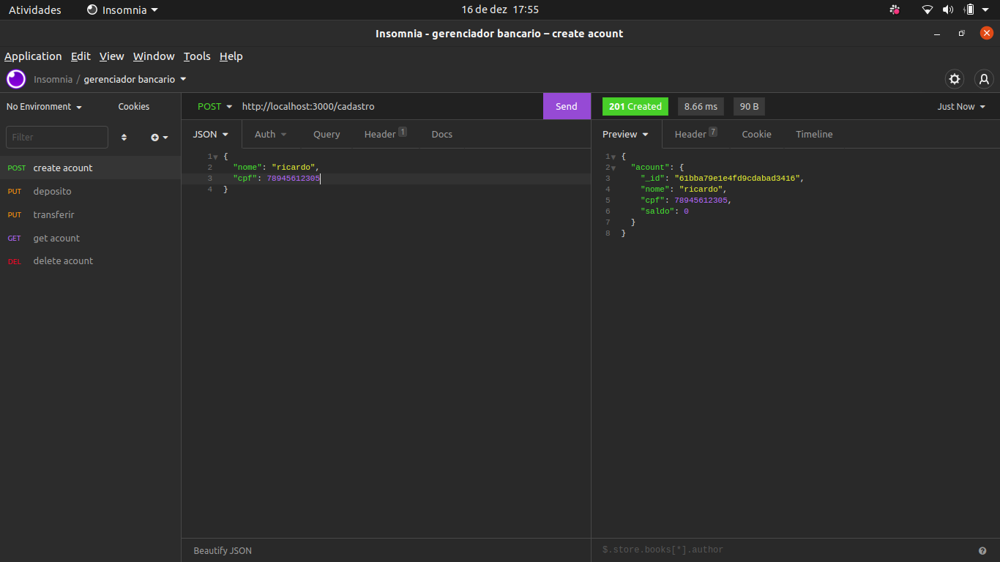

==> se voce tentar fazer uma conta só com o cpf ou só com o nome a api retorna : 


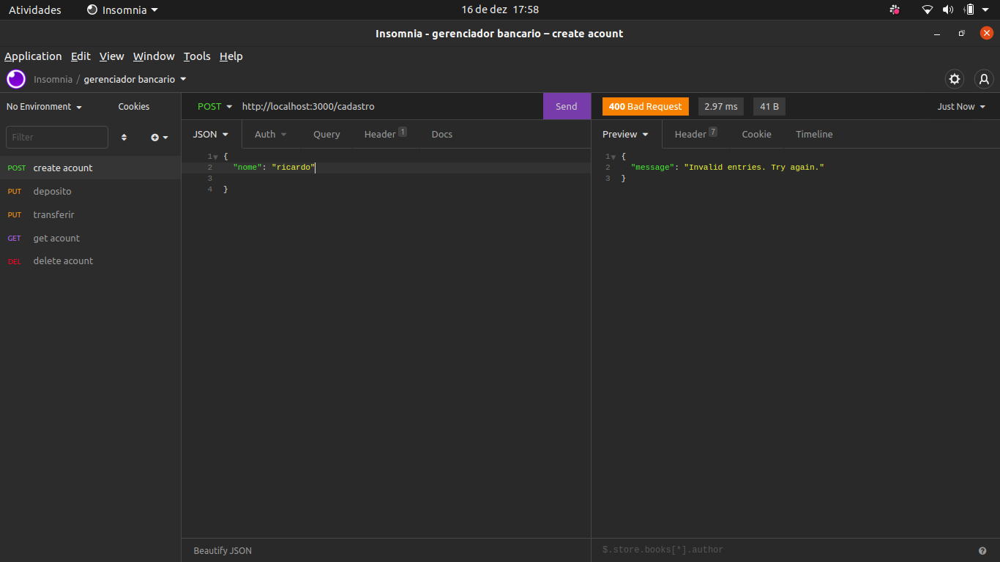

==> se tentar cadastrar mais de uma conta por cpf a api retorna : 
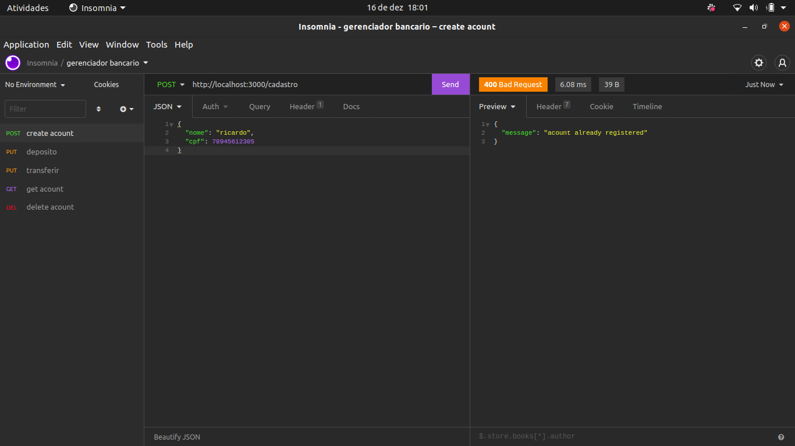

## Deposito 

==> insira esse endereço no cliente que você está usando com a modalidade put.
`http://localhost:3000/deposit`
==> e coloque o comando nele assim como no exemplo com o id da conta que você criou anteriormente , valor do deposito e o cpf.
``` 
{	
	"id": "{id fornecido pela sua maquina no cliente}",
  "valor": 2000,
  "cpf": 78945612305
}
```
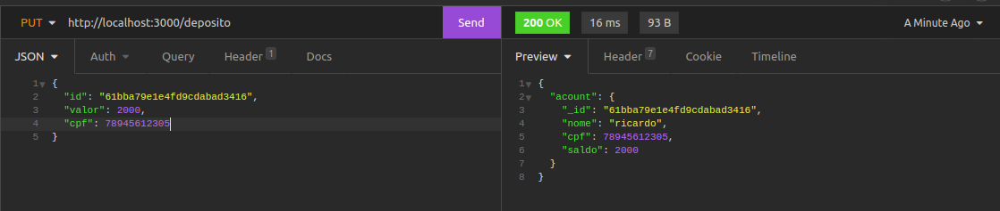

==> se o valor do deposito for negativo a api retorna a seguinte menssagem.

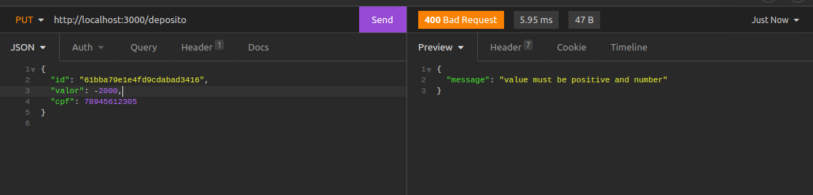

==> se o valor for maior que 2000 a api retorna a seguinte mensagem.

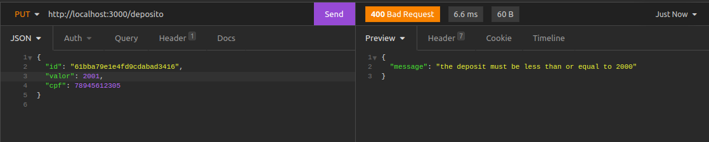

==> se o saldo da conta for maior que 10000 a api não permite mais depositos
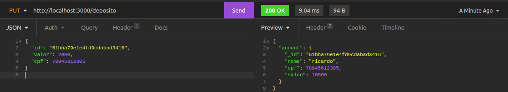
==>
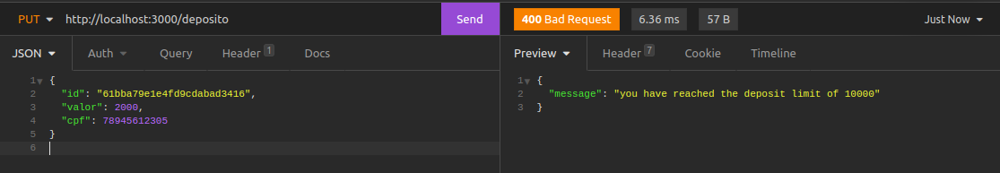

## Transferir

==> insira esse endereço no cliente que você está usando com a modalidade put.
`http://localhost:3000/transfer`

==> para tranferir é necessario o cpf do pagante e do recebedor assim como o valor:

``` 
{
  "valor": 2000,
  "pagador_cpf": 78945612305,
  "beneficiado_cpf": 78945612306
}
```

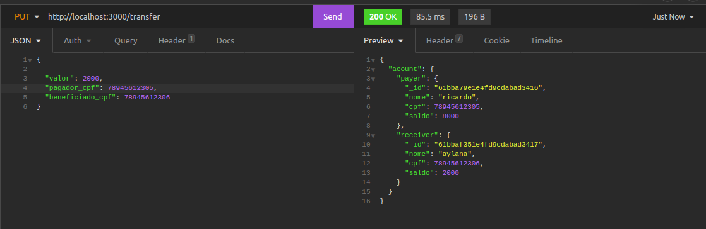

==> quando se tenta transferir mais do que se tem na conta a api impede e responde :
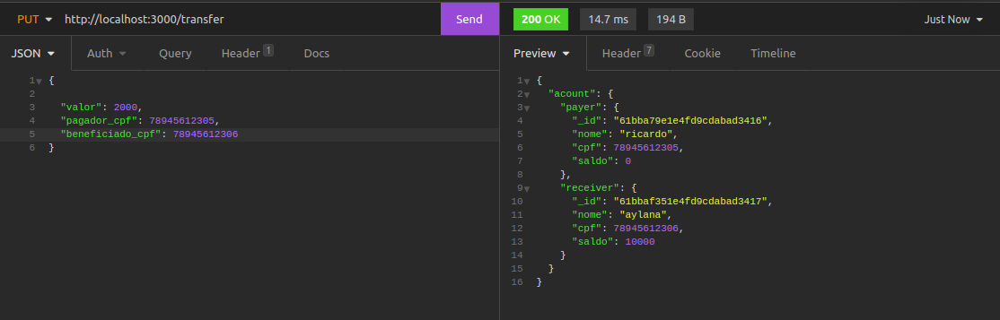
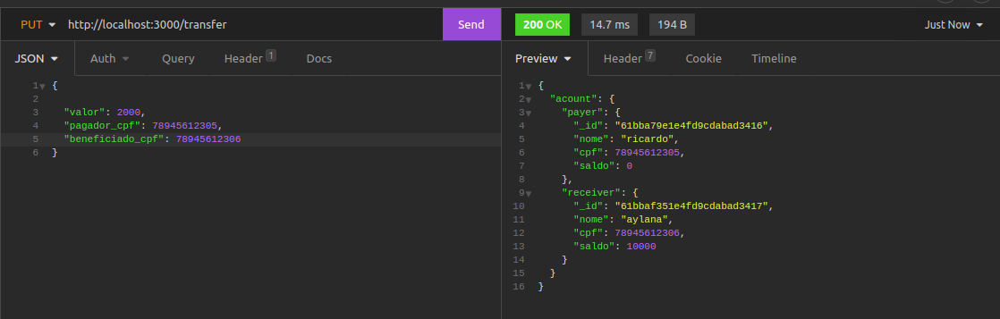


++>não tem nenhuma taxa para fazer transferencias ou depositos mas é possivel implementar isso em services.

## extras
==> você pode pegar todas as contas criadas pelo endpont com o verbo GET ao invez de post ou put:
`http://localhost:3000/users`

==> támbem é possivel deletar a conta através do endpoint com o id da conta:

`http://localhost:3000/delete/{id fornecido pela sua maquina no cliente}`
onde o id tem que ser adcionado como parâmetro na url
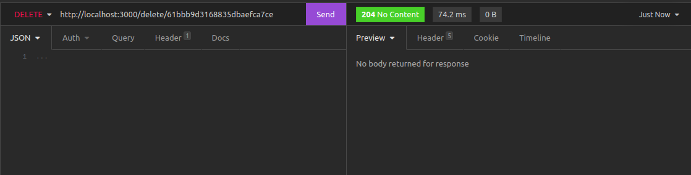

==> por fim quero agradecer por ter chegado até aqui e comente no codigo dicas se achar que posso melhorar.

## OBRIGADO.
